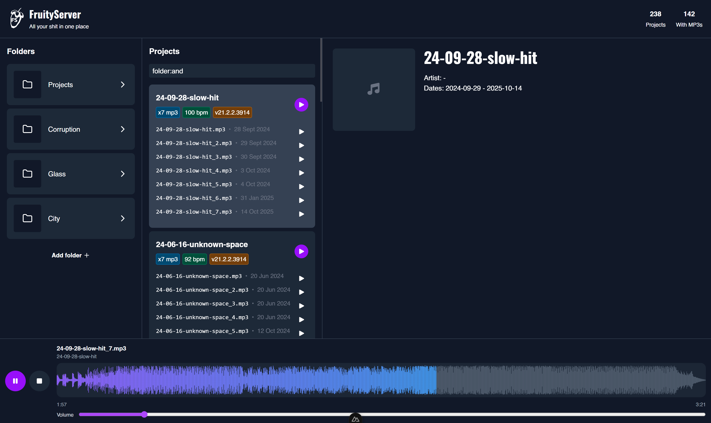

# Fruity Server

> *All your shit in one place.*

<p align="center">
  
</p>

<br>

Got hundreds of unfinished demos rotting in your FL Studio projects folder? Tired of digging into each one just to hear what that “idea_v3_final_fixed.flp” actually sounds like? Fruity Server is here to fix that mess. It scans your project directory, finds every render, and gives you a slick web interface where you can instantly play back your tracks — no FL Studio, no opening folders, no pain.

With Fruity Server, all your demos live in one place, ready to explore. Just click a project to play the latest render or dive into older versions with a waveform visualizer that makes scrubbing through your music a joy. It’s like a personal SoundCloud for your chaotic FL Studio vault — only faster, cleaner, and fully yours.

<br>



<p align="center">
	⚠️ <i>Under construction!</i> ⚠️
</p>

<br>
<br>

## Setup

Make sure to install dependencies:

```bash
# npm
npm install

# pnpm
pnpm install

# yarn
yarn install

# bun
bun install
```

## Development Server

Start the development server on `http://localhost:3000`:

```bash
# npm
npm run dev

# pnpm
pnpm dev

# yarn
yarn dev

# bun
bun run dev
```

## Production

Build the application for production:

```bash
# npm
npm run build

# pnpm
pnpm build

# yarn
yarn build

# bun
bun run build
```

Locally preview production build:

```bash
# npm
npm run preview

# pnpm
pnpm preview

# yarn
yarn preview

# bun
bun run preview
```

### Setting the Projects Directory

By default, Fruity Server scans the `./projects` directory for FL Studio projects. You can change this by setting the `PROJECTS_DIR` environment variable to your desired path.

## License

Copyright © 2025 Dmytro "DeLy" Obukhov

Permission is hereby granted, free of charge, to any person obtaining a copy of this software and associated documentation files (the "Software"), to deal in the Software without restriction, including without limitation the rights to use, copy, modify, merge, publish, distribute, sublicense, and/or sell copies of the Software, and to permit persons to whom the Software is furnished to do so, subject to the following conditions:

The above copyright notice and this permission notice shall be included in all copies or substantial portions of the Software.

THE SOFTWARE IS PROVIDED "AS IS", WITHOUT WARRANTY OF ANY KIND, EXPRESS OR IMPLIED, INCLUDING BUT NOT LIMITED TO THE WARRANTIES OF MERCHANTABILITY, FITNESS FOR A PARTICULAR PURPOSE AND NONINFRINGEMENT. IN NO EVENT SHALL THE AUTHORS OR COPYRIGHT HOLDERS BE LIABLE FOR ANY CLAIM, DAMAGES OR OTHER LIABILITY, WHETHER IN AN ACTION OF CONTRACT, TORT OR OTHERWISE, ARISING FROM, OUT OF OR IN CONNECTION WITH THE SOFTWARE OR THE USE OR OTHER DEALINGS IN THE SOFTWARE.